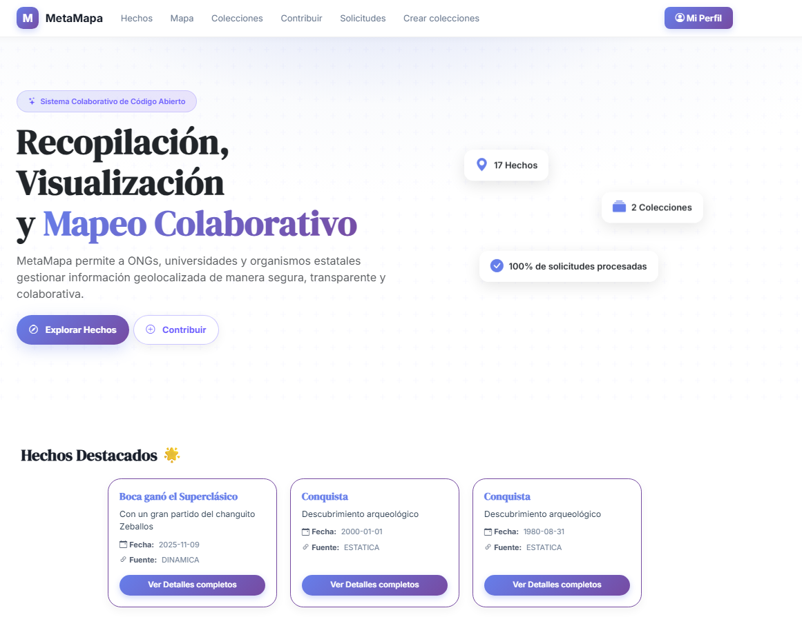
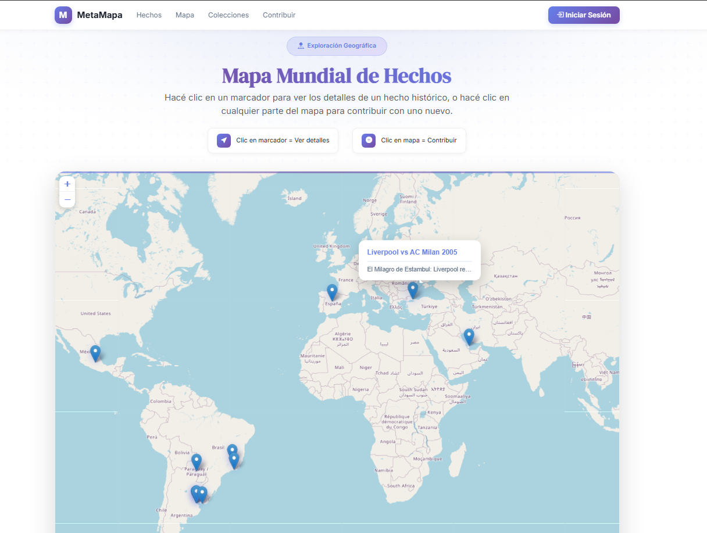
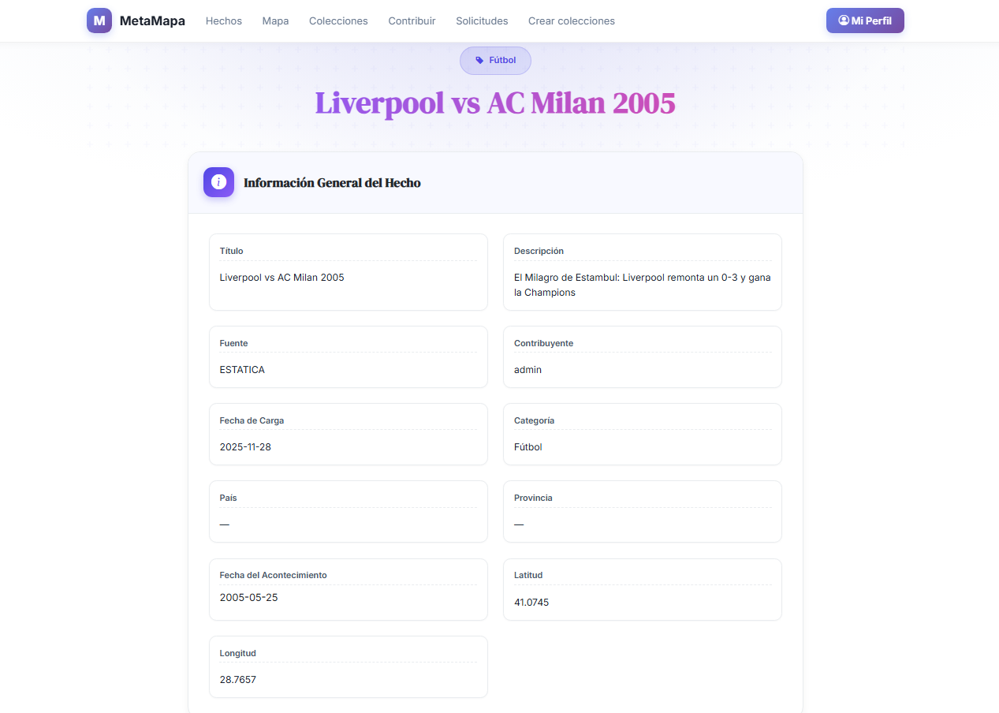
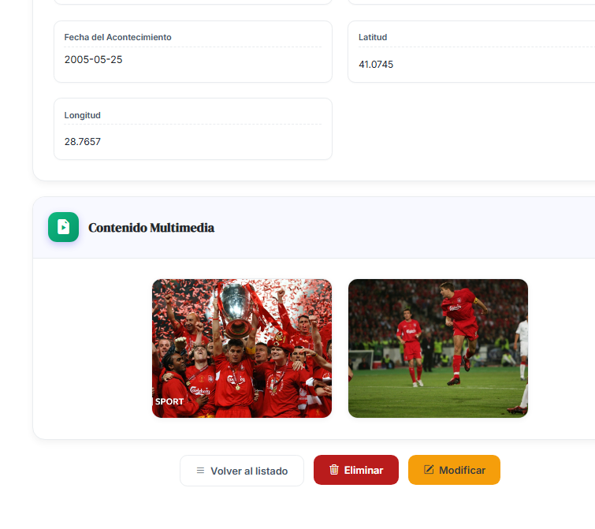
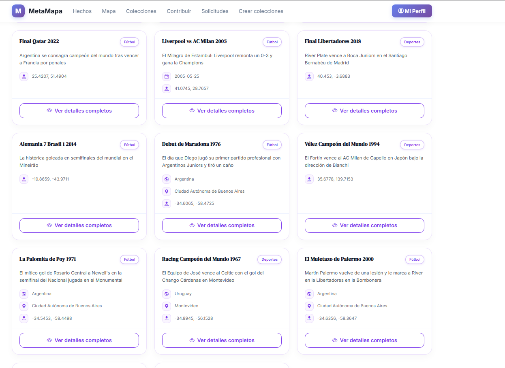
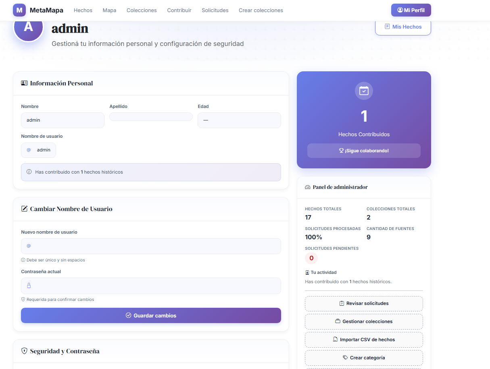

# Trabajo Práctico Anual Diseño de Sistemas de Información 2025: MetaMapa 

## El presente trabajo consiste en una aplicación web en la cual se pueden cargar hechos y visualizarlos en un mapa interactivo.

- Está estructurado en dos proyectos Maven que se comunican entre sí mediante API Rest. 
  - Server Backend: Encargado de la lógica de negocio.
    - Tecnologías: Java Spring Boot, Spring Security, MySQL, Hibernate/JPA
  - Server Frontend: Encargado del renderizado de las vistas.
    - Almacena la sesión del usuario, y dentro de la misma almacena un access token y un refresh token, ambos generados por Server Backend cuando el usuario inicia sesión.
      - Con el access token, el Server Frontend se comunica con el Server Backend. 
    - Tecnologías: Java Spring Boot, Spring Security, HTML, CSS, Javascript, Thymeleaf, Bootstrap

- Por la estructura de los proyectos explicada anteriormente, las sesiones del usuario resultan ser mixtas.
  

---

## Algunos ejemplos de uso

### Landing page con hechos destacados y estadísticas del sitio

  

---

### Mapa interactivo con hechos que cuentan con sus respectivas coordenadas

  

---

### Visualización de detalles de un hecho

  

---

### Los hechos pueden incluir contenido multimedia como imágenes y/o videos

  

---

### Visualización de los hechos subidos con su categoría y demás atributos. En este caso sólo se observan categorías fútbol y deportes

  

---

### Pestaña de perfil
#### El usuario puede modificar tanto sus datos personales como su nombre de usuario y contraseña
#### En el ejemplo, el usuario tiene el rol de ADMINISTRADOR, por lo que tiene un panel que le permite crear nuevas categorías, colecciones, analizar solicitudes sobre hechos realizadas por usuarios contribuyentes/visualizadores e importar hechos desde un CSV.

  

